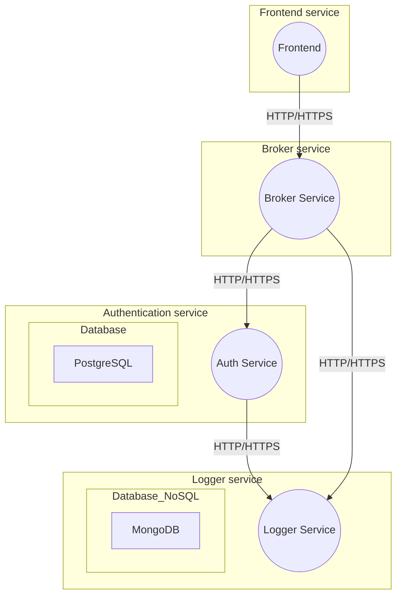

### Microservices in Go

This is a sample project for a microservice architecture. Currently, the following services have been partially
implemented:

| Service        | Description                                                                               |
|----------------|-------------------------------------------------------------------------------------------|
| Front-End      | Displays web page to test all services.                                                   |
| Broker         | Routes requests to the appropriate backend service.                                       |
| Authentication | A simple authentication service that uses Chi as the router and Postgres as the database. |
| Logging        | Allows clients to write log entries to a MongoDB database.                                |

The following services will be added later:

* Listener service: Receives messages from RabbitMQ and acts upon them.
* Mail service: Takes a JSON payload, converts into a formatted email, and sends it out.



#### Table of Contents

<div class="toc">
  <ul>
    <li><a href="#getting-started">Getting Started</a></li>
    <li><a href="#project-structure">Project Structure</a></li>
    <li><a href="#usage">Usage</a>
      <ul>
        <li><a href="#front-end">Front-end</a></li>
        <li><a href="#broker-service">Broker service</a></li>
        <li><a href="#authentication-service">Authentication Service</a></li>
        <li><a href="#logger-service">Logger Service</a></li>
      </ul>
    </li>
  </ul>
</div>

#### Getting Started

Prerequisites:

* Go 1.18
* Postgres
* Docker

To get started, clone this repository and navigate to the project directory:

```
git clone https://github.com/konstantin-evo/microservices-in-go.git
cd microservices-in-go
```

1. Start the project using docker-compose
2. Build front-end app
3. Run app

```
cd ./project && docker-compose up -d
cd ./../front-end && env CGO_ENABLED=0 go build -o frontApp ./cmd/web
./frontApp 
```

The App should now be accessible at `http://localhost`.

<p align="right">(<a href="#table-of-contents">back to the Table of content</a>)</p>

#### Project Structure

```
.
├── front-end
│ ├── cmd
│ │ └── web
│ │ ├── main.go
│ │ └── templates
│ │ ├── base.layout.gohtml
│ │ ├── footer.partial.gohtml
│ │ ├── header.partial.gohtml
│ │ └── test.page.gohtml
│ └──go.mod
├── broker-service
│ ├── cmd
│ │ └── api
│ │ ├── handlers.go
│ │ ├── helpers.go
│ │ ├── main.go
│ │ └── routes.go
│ ├── data
│ │ └── models.go
│ ├── go.mod
│ └── broker-service.dockerfile
├── authentication-service (the structure is the same as broker-service)
├── logging-service (the structure is the same as broker-service)
└── project
  ├── Makefile
  └── docker-compose.yml
```

<p align="right">(<a href="#table-of-contents">back to the Table of content</a>)</p>

#### Usage

##### Front-end

This project is a front-end service that interacts with microservices in Go.

The application interface consists of buttons to test each microservice and fields to input authentication details.

To test a microservice, click on the corresponding button. The application will send a request to the microservice and
display the response in the "Received" section. The request payload will be displayed in the "Sent" section.

If an error occurs, the error message will be displayed in the "Logs" section.

<p align="right">(<a href="#table-of-contents">back to the Table of content</a>)</p>


##### Broker Service

The broker service serves as a proxy between clients and various backend services. It is responsible routing requests to
the appropriate backend service.

**Endpoints**

The broker service provides two endpoints:

* `/`
* `/handle`

`GET /` is a simple endpoint that returns a response indicating that the broker service is up and running.

Response:

```bash
HTTP/1.1 200 OK
Content-Type: application/json
```

```json
{
  "error": false,
  "message": "Hit the broker"
}
```

`POST /handle`

This endpoint is used to handle requests from clients. The broker service expects a JSON payload with an action field
indicating the type of action to perform, and an optional auth field containing authentication information.

The request and response depend on the `action` field. The example for authentication:

```json
{
  "action": "auth",
  "auth": {
    "email": "user@example.com",
    "password": "password123"
  }
}
```

If the action field is not recognized, the response will contain an error message:

```bash
HTTP/1.1 400 Bad Request
Content-Type: application/json
```

```json
{
  "error": true,
  "message": "unknown action"
}
```

<p align="right">(<a href="#table-of-contents">back to the Table of content</a>)</p>

##### Authentication Service

This is a simple authentication service built in Go, which uses Chi as the router and Postgres as the database.

**Endpoints**

The following endpoints are available:

`POST /authenticate` - authenticate a user.

The request payload should contain the following fields: email and password. If the credentials are valid, the endpoint
will return a JSON response containing the user object and a success message. If the credentials are invalid, it will
return an error message.

Example request:

```bash
POST /authenticate HTTP/1.1
Host: localhost:80
Content-Type: application/json
```

```json
{
  "email": "john@example.com",
  "password": "password123"
}
```

Example response:

```bash
HTTP/1.1 202 Accepted
Content-Type: application/json
```

```json
{
  "error": false,
  "message": "Logged in user john@example.com",
  "data": {
    "id": 1,
    "email": "john@example.com",
    "first_name": "John",
    "last_name": "Doe",
    "active": 1,
    "created_at": "2022-10-15T14:35:00Z",
    "updated_at": "2022-10-15T14:35:00Z"
  }
}
```

If the email and password are invalid, the server will respond with an error message:

```bash
HTTP/1.1 400 Bad Request
Content-Type: application/json
```

```json
{
  "error": true,
  "message": "invalid credentials"
}
```

**Structure**

The code is structured as follows:

* `cmd/api/main.go` - the main entry point for the application.
* `cmd/api/routes.go` - the routing and middleware configuration for the application.
* `cmd/api/handlers.go` - the request handlers for the endpoints.
* `cmd/api/helpers.go` - some helper functions for parsing JSON, writing JSON responses, and handling errors.
* `data/models.go` - the database models for the application.
* `authentication-service.dockerfile` - the Dockerfile for the application.

<p align="right">(<a href="#table-of-contents">back to the Table of content</a>)</p>

##### Logger Service

Logging service that allows clients to write log entries to a MongoDB database.

The service is used via Broker for testing use, and directly for other services without interaction with users. For
example, Auth service send POST request when user successfully authenticated.

**Endpoints**

The following endpoints are available:

`POST /log`

The `/log` endpoint is used to write log entries to the MongoDB database. It expects a JSON payload that contains the
name and data fields.

Request Example:

```
POST /log HTTP/1.1
Content-Type: application/json
```

```json
{
  "name": "info",
  "data": "This is an info message."
}
```

Response Example:

```
HTTP/1.1 202 Accepted
Content-Type: application/json
```

```json
{
  "error": false,
  "message": "The message is successfully logged in the service.",
  "data": null
}
```

**Structure**

The code is structured as follows:

* `cmd/api/main.go` - the main entry point for the application.
* `cmd/api/routes.go` - the routing and middleware configuration for the application.
* `cmd/api/handlers.go` - the request handlers for the endpoints.
* `cmd/api/helpers.go` - some helper functions for parsing JSON, writing JSON responses, and handling errors.
* `data/models.go` - the database models for the application.
* `logger-service.dockerfile` - the Dockerfile for the application.

<p align="right">(<a href="#table-of-contents">back to the Table of content</a>)</p>
